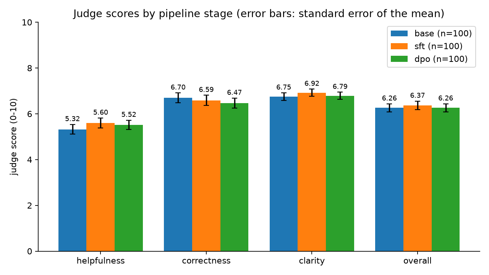

# Crucible — QLoRA fine-tuning with a judge-scored DPO loop

Fine-tune a 3B model with QLoRA on one 8 GB laptop GPU, have a larger model
score and rank the results, then train DPO on those preferences — and report
what actually happened.

What actually happened is that **supervised fine-tuning lowered perplexity by
12.3% and made the model worse.** The pipeline is built to catch exactly that.

```
UltraChat 10k
     │  Phase 0 — ingest, four disjoint splits
     ▼
Qwen2.5-3B-Instruct ── Phase 1 — QLoRA SFT (nf4, LoRA on attention) ──▶ adapters/sft
     │                                                                      │
     │  Phase 2 — base and SFT answer the held-out judge split               │
     ▼                                                                      ▼
        gpt-oss-120b scores each response 0-10 ───────▶ results/judge_scores.csv
     │
     │  Phase 3 — gpt-oss-20b ranks base vs SFT pairwise, both orders
     ▼                                             ──▶ data/prefs.jsonl
DPO from the SFT adapter ──▶ adapters/dpo
     │
     ▼  Phase 4 — perplexity · judge scores · decode throughput ──▶ results/
```

## Results

| Stage | Perplexity (held-out) | Pairwise vs base | Judge score, paired Δ |
|---|---|---|---|
| base | 3.609 | — | — |
| SFT | **3.165** (−12.3%) | **loses 70 of 78** (10% win rate) | −0.21 (95% CI −0.75 to +0.32) |
| DPO | 3.169 | *scoring pending* | *scoring pending* |

DPO training: loss **0.693 → 0.476**, reward margin **1.33**, reward accuracy
**87.5%** on 78 preference pairs.

Decode throughput, single stream, greedy, 3 interleaved rounds after a
discarded warmup:

| Stage | Median tok/s | Range | vs base |
|---|---|---|---|
| base | **11.59** | 7.36 - 12.36 | — |
| SFT | 7.90 | 5.55 - 8.20 | **−31.8%** |
| DPO | 8.11 | 7.32 - 8.56 | **−30.0%** |

An unmerged LoRA adapter costs about 30% of decode throughput, because it runs
as extra per-layer matmuls at every step. That is the cost `export merge` exists
to remove.



Perplexity is measured on 500 held-out UltraChat pairs with prompt tokens
masked, through the same 4-bit quantisation used in training — a bf16
perplexity would describe a model this pipeline never produces.

## Findings

### 1. SFT lowered perplexity and made the model worse

Perplexity fell 12.3% while the judge preferred the *base* model in 70 of 78
pairwise comparisons. Both are true, and they are not in conflict.

Qwen2.5-3B-**Instruct** is already instruction-tuned. UltraChat's responses come
from a weaker teacher. Training on them moved the model closer to UltraChat's
distribution — which is what perplexity measures — and further from where it
started, which is what quality measures. Fine-tuning an already-aligned model on
mid-quality data is regression toward the corpus, not learning.

**Reported alone, the perplexity number would have called this run a success.**

### 2. Pairwise judging separates models that absolute scoring cannot

The same judge, on the same responses, gave two different answers:

| Method | Verdict |
|---|---|
| Pairwise A/B | base preferred in 70 of 78 (90%) |
| Absolute 0-10 | paired Δ −0.21, CI −0.75 to +0.32 — indistinguishable from zero |

Absolute scoring is blunt because the judge rates almost everything near the
top: a competent two-sentence answer scored 9.3/10 despite a rubric stating
that competent-but-unremarkable is a 6. Real differences compress into that
narrow band. Asked *which of these two is better*, the same judge separates
them cleanly.

### 3. QLoRA on 8 GB is memory-bound, and both obvious speedups backfire

| Change | Expectation | Measured |
|---|---|---|
| Batch size 1 → 2 | faster | **slower**: 0.38 → 0.251 samples/s, peak 7.21 GiB |
| Gradient checkpointing off | ~30% faster | **~40× slower**: 16 examples took 28 min |

Past roughly 7.3 GiB, Windows oversubscribes the GPU into host memory and
throughput collapses. Checkpointing holds peak VRAM at 5.20 GiB, and paying to
recompute a forward pass beats paging weights across PCIe. The failure mode is
not an out-of-memory error — it is silent, and it looks like slow code.

A related trap: the trainer's ETA read **14.9 h** at step 4 of a run that takes
7.2 h, because length-grouped batching schedules the longest batches first. The
token budget (4.01 M tokens ÷ ~155 tok/s) is the honest estimate.

### 4. The critic walks the regression back

Because the judge preferred base responses in 90% of decided pairs, DPO's
training signal says *be more like the base model*. The loop closes as designed:
SFT regressed the model, the critic detected it, and DPO pushes back toward it —
reward accuracy 87.5%, margin 1.33, with perplexity flat (3.1652 → 3.1689), which
is correct behaviour for an objective that optimises a preference margin rather
than likelihood.

### 5. Judge reliability is measured, not assumed

Every pair is judged **twice, with the two responses swapped**. 78 of 97 (80%)
produced the same winner both times; the remaining 20% flipped with position and
were discarded rather than trained on. A judge that cannot beat its own position
bias is not a signal, and that fraction is the number that says this one mostly is.

## Running it

```bash
bash scripts/setup_env.sh     # venv + torch (cu128) + training stack
cp .env.example .env          # add GROQ_API_KEY

python -m crucible.data all   # Phase 0  — ingest + four disjoint splits
python -m crucible.sft --limit 3000   # Phase 1  — QLoRA SFT (~2.7 h)
bash scripts/autopilot.sh     # Phases 2-4, unattended and resumable
```

torch must come from the CUDA wheel index, not PyPI: the default Windows wheel
is CPU-only and bitsandbytes refuses to load against it.

Those three commands are the path this project was actually run through. The
`Makefile` wraps the same commands (`make data`, `make sft`, `make all`, plus
per-phase targets) if you have GNU make — which Windows does not ship, and
which this machine did not have, so the make targets are unverified.

`autopilot.sh` runs every GPU stage before anything that touches the API, and
guards each stage with the artifact it produces, so a crash or a rate-limit wall
resumes instead of repeating hours of work.

| Cost | Measured |
|---|---|
| SFT | 168.5 min — 2923 examples, 183 steps, peak 5.20 GiB |
| DPO | 10.3 min — 78 pairs, 19 steps |
| Generation | 18.7 min per 250 prompts — batch 16, 72.5 tok/s |

## Deploying the result

```bash
python -m crucible.export merge --adapter adapters/dpo --out exports/dpo-merged
TESSERA_MODEL=$PWD/exports/dpo-merged TESSERA_BACKEND=batched
```

`export merge` folds the LoRA weights into the base weights and writes a plain
Transformers checkpoint, which
[tessera](https://github.com/Chrissie-1/tessera-llm-inference-paged-kv-cache-speculative-decoding)
serves directly — paged KV cache, continuous batching, speculative decoding.

The merge runs on CPU in fp16 deliberately: merging into 4-bit weights means
dequantise-add-requantise, which is not the model the adapter was trained
against. It should also recover most of the ~30% decode throughput an unmerged
adapter costs (measured above), though this repo has not yet benchmarked the
merged checkpoint to confirm it.

## Design decisions

**Disjoint splits.** 10k conversations shuffled once with a fixed seed, then cut
into `sft` (8000), `eval` (500), `judge` (250) and `dpo` (1250). A judge score on
prompts the model trained on measures memorisation.

**Loss on the assistant turn only.** The prompt is tokenised twice — once with
the generation prefix, once with the response appended — and the overlapping
label positions are set to −100. Training on prompt tokens teaches a model to
write user turns.

**Two different judges.** Scoring uses gpt-oss-120b; the DPO preference signal
uses gpt-oss-20b. Partly necessity (rate limits, below), but it is the better
experiment: the model that produced the training signal is not the model that
evaluates the result, so a DPO gain cannot be the policy learning its
evaluator's quirks.

**No separate reference model.** With a PEFT policy, TRL uses the same base
weights with the adapter disabled as the DPO reference — correct here, and the
only thing that fits in 8 GB alongside the policy.

**Interleaved latency measurement.** Measured one model per process, the same
base config returned 8.25, 6.66 and 4.34 tok/s across sessions, and one ordering
had DPO beating base — impossible, since an adapter only adds work. The sweep now
loads the base once, attaches both adapters, interleaves rounds, discards a
warmup, and reports medians with min/max.

## Rate limits shaped this code

Groq's free tier allows ~200,000 judge tokens per model per day. At ~890 tokens
per call that is ~225 calls; this pipeline wants ~1,950 (~1.2 M tokens).
gpt-oss-120b spent an entire daily allowance scoring 223 base responses.

So the judge:

* caches every call on disk by (model, mode, prompt, responses), so a re-run
  costs only what did not finish;
* paces calls under a rolling one-minute token budget that settles against the
  API's reported usage — retrying a 429 cannot fix a *rate*;
* fails fast on a per-day rejection and cancels the queue, while waiting out a
  per-minute one: retrying a daily limit re-asks a question whose answer cannot
  change until tomorrow;
* keeps everything already paid for when a wall is hit mid-run.

## Limitations

* **DPO is small.** 78 preference pairs, bounded by the daily judge budget.
  Conclusions from 78 pairs are weak, and labelled as such.
* **Scoring is partial.** base 100 prompts, SFT 25, DPO pending the next quota
  reset; the paired delta rests on the 25 prompts both stages share, which is why
  its confidence interval is wide enough to contain zero.
* **One seed per configuration.** Differences of a few tenths of a judge point
  are not separable from run-to-run variance.
* **Latency ranges are wide** (base spans 7.36-12.36 tok/s across three rounds).
  The ~30% adapter cost is far larger than that spread and survives it; smaller
  differences measured this way would not.
* **SFT used 3000 of 8000 examples** (2.7 h against 7.2 h) to leave GPU time for
  the rest of the pipeline.
* The judge is one model family, one language, one rubric. The order swap
  controls for position bias only — not for length or formatting preference.

## Tests

```bash
make test    # CPU only, no model, no network
make lint
```

Ten tests covering what fails *silently*: the loss mask covering exactly the
prompt, padding aligned with −100, the A/B verdict translated back to the right
response after the order swap, position-biased pairs dropped, score clamping,
judge cache reuse, and `.env` never overriding a real environment variable.

## Licence

MIT.
